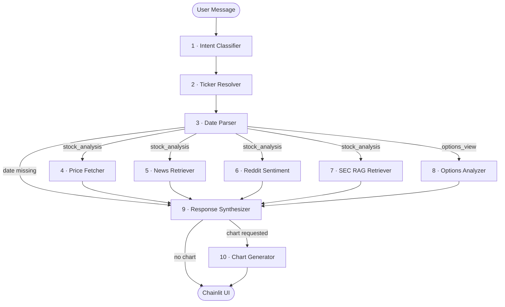

# Stock Insight Agent

> An AI-powered stock analysis agent that synthesizes price data, news, social sentiment, SEC filings, and options chain data into a unified natural-language response — built on LangGraph.


---

## What It Does

Ask the agent a question about a stock — in plain English — and it figures out what you're asking, pulls data from the right sources, and returns a coherent analysis with an optional interactive chart.

**Example queries:**
- *"What happened to NVIDIA around Q2 2024 earnings?"*
- *"Show me a chart of Apple's price last month"*
- *"What was the Reddit sentiment on Tesla during the Cybertruck launch?"*
- *"What does the options chain look like for AMD right now?"*

The agent resolves the ticker, parses the date range, routes to the relevant data nodes, and synthesizes everything into a single response with inline citations.

---

## Architecture

The agent is built as a **single-agent LangGraph workflow** — a directed graph of 10 nodes, each with a single responsibility. State flows through the graph as a typed dictionary. Conditional edges handle routing based on intent and available data.



### Node Responsibilities

| Node | Name | Purpose |
|------|------|---------|
| 1 | Intent Classifier | Classifies intent: `stock_analysis`, `options_view`, `chart_request`, `general_lookup`, `unknown` |
| 2 | Ticker Resolver | Extracts and validates the stock ticker symbol and company name |
| 3 | Date Parser | Parses natural language dates into ISO ranges; detects `include_current_snapshot` |
| 4 | Price Fetcher | Retrieves OHLCV data via yfinance (Alpha Vantage fallback); detects volume anomalies |
| 5 | News Retriever | Fetches relevant articles via NewsAPI (Google News RSS fallback) |
| 6 | Reddit Sentiment | Pulls posts from r/wallstreetbets, r/stocks, r/options; classifies each with an LLM |
| 7 | SEC RAG Retriever | Retrieves relevant chunks from SEC filings via ChromaDB; downloads and embeds on-demand |
| 8 | Options Analyzer | Fetches options chain: put/call ratio, IV, notable positions |
| 9 | Response Synthesizer | Merges all data into a narrative response with inline citations |
| 10 | Chart Generator | Produces an interactive Plotly candlestick chart from daily price data |

---

## Features

- **Natural language queries** — no structured input required; the agent resolves tickers, dates, and intent automatically
- **Multi-source data synthesis** — price data, news, Reddit sentiment, SEC filings, and options chain in one response
- **RAG pipeline** — SEC 10-Q and 10-K filings are downloaded, chunked, embedded, and stored in ChromaDB; retrieved by relevance at query time
- **Volume anomaly detection** — flags unusual trading activity by comparing period volume against a 90-day baseline
- **Interactive charts** — Plotly candlestick charts rendered directly in the chat UI
- **Session context memory** — follow-up queries inherit the previous ticker and date range without re-specifying
- **Source citations** — every claim is linked to its source (article, Reddit post, or SEC filing)
- **Observability** — full LangSmith tracing for every graph execution

---

## Tech Stack

| Layer | Technology |
|-------|-----------|
| Orchestration | [LangGraph](https://github.com/langchain-ai/langgraph) |
| Chat UI | [Chainlit](https://chainlit.io) |
| LLM | Groq — `llama-3.1-8b-instant` |
| Price Data | yfinance (primary), Alpha Vantage (fallback) |
| News | NewsAPI (primary), Google News RSS (fallback) |
| Social Sentiment | Reddit API via PRAW |
| SEC Filings | SEC EDGAR + ChromaDB vector store |
| Embeddings | ChromaDB (local) |
| Tracing | LangSmith |
| Testing | pytest |
| Language | Python 3.11+ |

---

## Setup

### 1. Clone and create virtual environment

```bash
git clone https://github.com/rituvilluri/stock-insight-agent.git
cd stock-insight-agent
python -m venv .venv
source .venv/bin/activate
```

### 2. Install dependencies

```bash
pip install -r requirements.txt
```

### 3. Configure environment variables

Create a `.env` file in the project root:

```env
# Required
GROQ_API_KEY=

# News (Finnhub primary, FMP fallback, Google RSS emergency fallback)
FINNHUB_API_KEY=
FMP_API_KEY=

# Reddit sentiment
REDDIT_CLIENT_ID=
REDDIT_CLIENT_SECRET=
REDDIT_USER_AGENT=stock-insight-agent/1.0

# Price data fallback (optional)
ALPHA_VANTAGE_API_KEY=

# Vector store (ChromaDB)
CHROMA_PERSIST_DIR=data/vector_store

# Observability
LANGSMITH_API_KEY=
LANGCHAIN_TRACING_V2=true
LANGCHAIN_PROJECT=stock-insight-agent
```

### 4. Run the app

```bash
PYTHONPATH=. chainlit run app/chainlit/app.py
```

---

## Development

```bash
# Run all tests
PYTHONPATH=. pytest tests/

# Run a specific node's tests
PYTHONPATH=. pytest tests/test_intent_classifier.py -v
```

The project uses a **test-first approach** — each node has a dedicated test file in `tests/`.

---

## Project Structure

```
stock-insight-agent/
├── agent/
│   └── graph/
│       ├── nodes/              # One file per LangGraph node
│       │   ├── state.py        # AgentState TypedDict (shared state schema)
│       │   ├── intent_classifier.py
│       │   ├── ticker_resolver.py
│       │   ├── date_parser.py
│       │   ├── data_fetcher.py
│       │   ├── news_retriever.py
│       │   ├── reddit_sentiment.py
│       │   ├── rag_retriever.py
│       │   ├── options_analyzer.py
│       │   ├── response_synthesizer.py
│       │   └── chart_generator.py
│       └── workflow.py         # LangGraph graph definition and edge routing
├── app/
│   └── chainlit/
│       └── app.py              # Chainlit UI — invokes graph, renders response + chart
├── llm/
│   └── llm_setup.py            # Groq LLM configs (classifier + synthesizer)
├── tools/                      # Utility tools (date parsing, stock analysis)
├── data/
│   └── vector_store/           # ChromaDB persistence
├── docs/
│   ├── TDD.md                  # Technical design document
│   ├── PRD.md                  # Product requirements
│   └── DecisionLog.md          # Architectural decision records
└── tests/                      # pytest test suite — one file per node
```

---

## Design Decisions

Eleven architectural decisions are documented in [`docs/DecisionLog.md`](docs/DecisionLog.md), including:

- Why LangGraph over a monolithic agent
- Why Groq over OpenAI
- Why ChromaDB for the vector store
- How the RAG retrieval strategy handles missing filings
- Why state is typed explicitly rather than using message history
