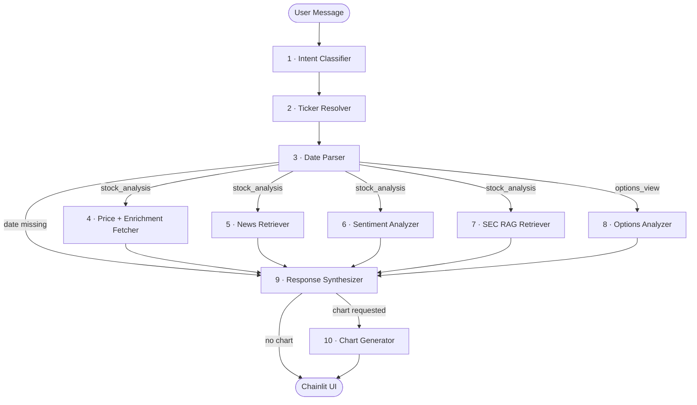

# Stock Insight Agent

> An AI agent that synthesizes price data, news, social sentiment, SEC filings, and options chain data into a cited investment brief — from a plain English query.

Designed, built, and shipped as a solo project — from PRD and architecture decisions through implementation, evaluation, and iteration.


---

## What It Does

Ask the agent a question about a stock in plain English. It resolves the ticker and date range, routes to the relevant data sources, and returns a coherent response with inline citations and an optional interactive chart.

**Example queries:**
- *"What happened to NVIDIA around Q2 2024 earnings?"*
- *"Show me a chart of Apple's price last month"*
- *"What was the Reddit sentiment on Tesla during the Cybertruck launch?"*
- *"What does the options chain look like for AMD right now?"*
- *"What are analysts saying about Microsoft heading into earnings?"*

---

## Architecture

The agent is a **single-agent LangGraph workflow** — a directed graph of 10 nodes, each with one responsibility. State flows through the graph as a typed dictionary. After intent classification, ticker resolution, and date parsing, the retrieval nodes fan out in parallel using LangGraph's `Send()` API — reducing response latency to the slowest individual node rather than the sequential sum.



### Node Responsibilities

| Node | Name | LLM Call | External API |
|------|------|----------|--------------|
| 1 | Intent Classifier | Yes | — |
| 2 | Ticker Resolver | Conditional | — |
| 3 | Date Parser | Conditional | Conditional |
| 4 | Price + Enrichment Fetcher | No | yfinance (analyst ratings, short interest, earnings proximity) |
| 5 | News Retriever | No | Finnhub · You.com · Google RSS · Firecrawl |
| 6 | Sentiment Analyzer | Yes | Reddit public JSON · Stocktwits |
| 7 | SEC RAG Retriever | No | SEC EDGAR · ChromaDB · Gemini Embeddings |
| 8 | Options Analyzer | No | yfinance (options chain, Black-Scholes, Max Pain) |
| 9 | Response Synthesizer | Yes | — |
| 10 | Chart Generator | No | — |

---

## Technical Highlights

**Two-model LLM strategy**
Classification tasks (intent, ticker, date, sentiment scoring) use Groq `llama-3.1-8b-instant` — fast, cheap, and sufficient for structured JSON output. The Response Synthesizer uses Gemini 2.5 Pro on Vertex AI with `thinking_budget=2048`. The thinking budget gives the model an internal reasoning pass to connect price action, news, sentiment, and filings causally rather than recite them as a list. These are different cognitive tasks; they warrant different models.

**Parallel retrieval via LangGraph `Send()`**
Nodes 4–7 are independent — none requires another's output. After date parsing, they fan out in parallel. Response latency equals the slowest node, not their sum. LangSmith traces confirmed a 2–4 second reduction on `stock_analysis` queries.

**Multi-layer news pipeline with full-text enrichment**
Finnhub (primary, ticker-specific) runs in parallel with You.com Search API (Layer 2, broader web coverage). Google News RSS serves as the fallback. For articles from known free-access domains, Firecrawl fetches the full article text post-retrieval. Snippet-only synthesis produces thin, low-confidence responses; full text enables specific, attributable claims.

**Dual social sentiment — no auth required**
Reddit public JSON endpoints (`reddit.com/r/*/search.json`) replace PRAW entirely — same data, no OAuth credentials, no rate-limit failures. Stocktwits runs as a co-primary source on every query, providing a purpose-built financial feed with pre-labeled Bullish/Bearish tags that reduce LLM classification calls. Reddit carries historical depth; Stocktwits carries recency.

**RAG over SEC filings**
10-K, 10-Q, 8-K, and earnings call transcripts are ingested from SEC EDGAR on demand, chunked, embedded with Gemini, and stored in ChromaDB with metadata pre-filtering by ticker and filing period. The retrieval interface is abstracted for a planned migration to ChromaDB Cloud.

**Trader-grade data enrichment**
The Price Fetcher extends beyond OHLCV: analyst consensus ratings, price targets, short float, days-to-cover, and earnings date proximity are retrieved in the same yfinance pass. The Options Analyzer computes Black-Scholes Greeks, Max Pain, and put/call ratio from the live options chain. These signals were identified by reviewing what working traders actually use to make decisions — not just what's easy to retrieve.

---

## Evaluation & Quality

Quality is tracked across experiments, not just at test time.

- **LangSmith tracing** — every graph execution is traced at the node level, making it straightforward to isolate where a response degraded
- **Custom LLM-as-judge evaluators** — hallucination score, answer relevance, and source grounding run against a curated dataset of stock analysis queries
- **Eval-gated development** — every node change in Phase 5 required a completed LangSmith experiment before the story closed; quality was a gate, not an afterthought
- **347 unit tests + 4 smoke tests** — one test file per node; covers happy path, fallback behaviour, error fields, and parallel branch isolation

---

## Tech Stack

### Core Stack

| Layer | Technology |
|-------|-----------|
| Orchestration | [LangGraph](https://github.com/langchain-ai/langgraph) |
| Chat UI | [Chainlit](https://chainlit.io) |
| LLM — Classification | Groq `llama-3.1-8b-instant` |
| LLM — Synthesis | Google Gemini 2.5 Pro (Vertex AI, `thinking_budget=2048`) |
| Embeddings | Google Gemini `text-embedding-004` (Vertex AI) |
| Vector Store | ChromaDB (local persistence) |
| Tracing & Evals | LangSmith |
| Testing | pytest |
| Language | Python 3.11+ |

### Data Sources

| Domain | Source |
|--------|--------|
| Price & Options | yfinance (primary), Alpha Vantage (fallback) |
| News | Finnhub · You.com Search API · Google News RSS |
| Article enrichment | Firecrawl |
| Social sentiment | Reddit public JSON · Stocktwits |
| SEC filings | SEC EDGAR (10-K, 10-Q, 8-K, earnings call transcripts) |

---

## Setup

### 1. Clone and create virtual environment

```bash
git clone https://github.com/rituvilluri/stock-insight-agent.git
cd stock-insight-agent
python -m venv .venv
source .venv/bin/activate
```

### 2. Install dependencies

```bash
pip install -r requirements.txt
```

### 3. Authenticate with Google Cloud (Vertex AI)

The synthesizer and embeddings use Application Default Credentials — no API key required.

```bash
gcloud auth application-default login
```

### 4. Configure environment variables

Create a `.env` file in the project root:

```env
# LLM — Classification
GROQ_API_KEY=

# Google Cloud — Synthesis (Gemini 2.5 Pro) + Embeddings (Vertex AI)
GOOGLE_CLOUD_PROJECT=        # e.g. stock-insight-agent
GOOGLE_CLOUD_LOCATION=       # e.g. us-central1

# News
FINNHUB_API_KEY=             # Primary news source
YOUCOM_API_KEY=              # Layer 2 — broader web coverage
FIRECRAWL_API_KEY=           # Full-text article enrichment

# Price data fallback (optional)
ALPHA_VANTAGE_API_KEY=

# Vector store
CHROMA_PERSIST_DIR=data/vector_store

# Observability
LANGSMITH_API_KEY=
LANGCHAIN_TRACING_V2=true
LANGCHAIN_PROJECT=stock-insight-agent
```

> Reddit and Stocktwits use public endpoints — no credentials required.

### 5. Run the app

```bash
PYTHONPATH=. chainlit run app/chainlit/app.py
```

### Development

```bash
# Run all tests
PYTHONPATH=. pytest tests/

# Run a single node's tests
PYTHONPATH=. pytest tests/test_intent_classifier.py -v

# Run LangSmith evaluation
PYTHONPATH=. python tests/evaluators/run_experiment.py
```

---

## Design Decisions

19 architectural decisions are documented in [`docs/DecisionLog.md`](docs/DecisionLog.md). A few that shaped the system most:

- **LangGraph over LangChain** — the workflow requires conditional routing and stateful fan-out; LangChain's linear chain paradigm doesn't support this natively
- **Two-model LLM split** — classification and synthesis are different cognitive tasks; optimising for one model for both produces a worse result on both
- **Single-agent graph over multi-agent** — the retrieval tasks are independent and share no inter-node dependencies; multi-agent coordination would add LLM overhead with no quality benefit
- **Reddit public JSON over PRAW** — OAuth credential failures degraded eval coverage; the public endpoints return the same data without authentication

Full rationale, options considered, and tradeoffs accepted for each decision are in the log.

---

## Roadmap

The agent runs fully locally today. What's next:

- [ ] Docker containerization
- [ ] GitHub Actions CI/CD pipeline
- [ ] Azure deployment
- [ ] ChromaDB Cloud migration (same API, managed persistence)